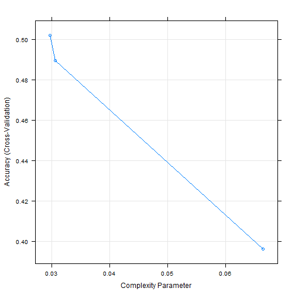
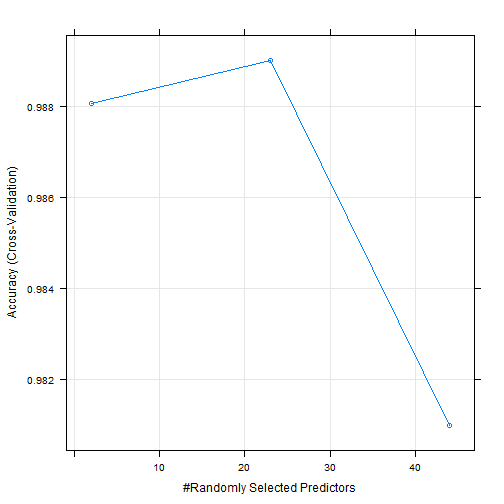
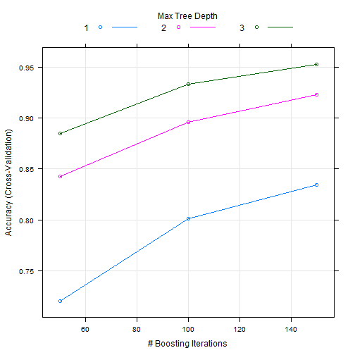

## Synopsis
This document details the analysis done on the Human Activity Detection Dataset. The dataset  has data about exercies done by 6 people who were asked to perform barbell lifts correctly and incorrectly in 5 different ways and the goal of this analysis is to predict the manner in which they did the exercise. 


### Data
The training data for this project are available here: 

https://d396qusza40orc.cloudfront.net/predmachlearn/pml-training.csv

The test data are available here: 

https://d396qusza40orc.cloudfront.net/predmachlearn/pml-testing.csv


### Load Data

#### Load Libraries
Libraries required for this analysis are loaded below


```r
library(caret)
library(randomForest)
library(rpart)
```

#### Read HAR Data

```r
trainurl<-"https://d396qusza40orc.cloudfront.net/predmachlearn/pml-training.csv"
datainp<-read.csv(trainurl,na.strings=c("", "NA"))

testurl<-"https://d396qusza40orc.cloudfront.net/predmachlearn/pml-testing.csv"
datatst<-read.csv(testurl,na.strings=c("", "NA"))
dim(datainp)
```

```
## [1] 19622   160
```


### Analyse and Clean Data
As you see above, there are 160 columns. The column 'classe' is what need to predict from the information available in rest of the fields. The below identifies the percentage for NA values in each of the columns and display a sample output. 
 
#### Identify NA columns

```r
percentage_na<-sapply(datainp,function(x){
        paste(round(100*(mean(is.na(x))),2),"%")})
percentage_na[30:40]
```

```
##     var_roll_belt    avg_pitch_belt stddev_pitch_belt    var_pitch_belt 
##         "97.93 %"         "97.93 %"         "97.93 %"         "97.93 %" 
##      avg_yaw_belt   stddev_yaw_belt      var_yaw_belt      gyros_belt_x 
##         "97.93 %"         "97.93 %"         "97.93 %"             "0 %" 
##      gyros_belt_y      gyros_belt_z      accel_belt_x 
##             "0 %"             "0 %"             "0 %"
```

It has been observed that there are many columns which has around 97% of NA values in that, so we need to ignore them for our prediction model.

During exploratory data analysis, it has been observed that the first 7 fields has name,timestamp,window etc which are not found to be relevant for model purposes as they are not relevant to movement sensors. So they need removing as well.
 
#### Remove NA columns and first 7 columns

```r
cleandata<-datainp[,colSums(is.na(datainp)) < 19000]
colnamesx<-names(cleandata)
remcolns<-colnamesx[1:7]
cleandata<-cleandata[,!(names(cleandata) %in% remcolns)]
dim(cleandata)
```

```
## [1] 19622    53
```

After data cleaning, we have less number of columns that may have the information about our predictor column 'classe'. Now, we identify the columns that are co-related and remove them as well as seen below.

```r
descrCor <-  cor(cleandata[,1:52])
highlyCorDescr <- findCorrelation(descrCor, cutoff = .85)
filtered_data <- cleandata[,-highlyCorDescr]
dim(filtered_data)
```

```
## [1] 19622    45
```

 
### Prediction Models

Now the above dataset has the information which we believe is relevant for our prediction model. We first split the data into test(30%) and training dataset(70%). We train the model using the train dataset and validate the model usung the test dataset.

```r
set.seed(125)
inTraining <- createDataPartition(filtered_data$classe, p = .7, list = FALSE)

training <- filtered_data[ inTraining,]
testing  <- filtered_data[-inTraining,]
```

For classification , we try 3 different models as below 
 
    Decision Trees
  
    Random Forest
  
    Generalized Boosted Regression Models
  
  
#### Out of Sample error and Cross validation
For each of the models, we specific the number of folds for cross-validation as 5 to allow 5 resampling iterations. 

The expectation is that the out of sample error i.e the error in applying the model to a test dataset not used during model building , to be less. If less we can conclude that the model is fit for purpose. 


#### Decision Trees
We fit the model using the Becision tree method and predict the values of the test partition we created. But as seen in the outcome, the accuracy is just 49% which means the model we have built is not fit for the purposes.

```r
fit1 <- train(classe ~ ., data = training, method="rpart",
                 trControl = trainControl(method = "cv", number = 5))
testval<-predict(fit1, newdata=testing)
confusionMatrix(testing$classe,testval)
```

```
## Confusion Matrix and Statistics
## 
##           Reference
## Prediction    A    B    C    D    E
##          A 1529   33   86   26    0
##          B  484  385  232   36    2
##          C  475   37  416   97    1
##          D  345  203  110  228   78
##          E  236  218  227   36  365
## 
## Overall Statistics
##                                           
##                Accuracy : 0.4967          
##                  95% CI : (0.4838, 0.5095)
##     No Information Rate : 0.5215          
##     P-Value [Acc > NIR] : 0.9999          
##                                           
##                   Kappa : 0.3424          
##  Mcnemar's Test P-Value : <2e-16          
## 
## Statistics by Class:
## 
##                      Class: A Class: B Class: C Class: D Class: E
## Sensitivity            0.4982  0.43950  0.38842  0.53901  0.81839
## Specificity            0.9485  0.84947  0.87329  0.86525  0.86817
## Pos Pred Value         0.9134  0.33802  0.40546  0.23651  0.33734
## Neg Pred Value         0.6343  0.89654  0.86520  0.96037  0.98314
## Prevalence             0.5215  0.14885  0.18199  0.07188  0.07579
## Detection Rate         0.2598  0.06542  0.07069  0.03874  0.06202
## Detection Prevalence   0.2845  0.19354  0.17434  0.16381  0.18386
## Balanced Accuracy      0.7234  0.64448  0.63085  0.70213  0.84328
```

#### Random Forest
We fit the model using the Random forest method and predict the values of the test partition we created. As seen in the outcome, the accuracy is more than 99% which means the model. 

The __out of sample error is just .0097__ so this model's performance is definitely better than the decision tree model.  This may be the best fit but we will have to try Generalized Boosted Regression as well

```r
fit2 <- train(classe ~ ., data = training, method="rf",
                 trControl = trainControl(method = "cv", number = 5))
testval<-predict(fit2, newdata=testing)
confusionMatrix(testing$classe,testval)
```

```
## Confusion Matrix and Statistics
## 
##           Reference
## Prediction    A    B    C    D    E
##          A 1674    0    0    0    0
##          B    7 1127    5    0    0
##          C    0   16 1001    9    0
##          D    1    0   12  950    1
##          E    0    0    4    2 1076
## 
## Overall Statistics
##                                           
##                Accuracy : 0.9903          
##                  95% CI : (0.9875, 0.9927)
##     No Information Rate : 0.2858          
##     P-Value [Acc > NIR] : < 2.2e-16       
##                                           
##                   Kappa : 0.9877          
##  Mcnemar's Test P-Value : NA              
## 
## Statistics by Class:
## 
##                      Class: A Class: B Class: C Class: D Class: E
## Sensitivity            0.9952   0.9860   0.9795   0.9886   0.9991
## Specificity            1.0000   0.9975   0.9949   0.9972   0.9988
## Pos Pred Value         1.0000   0.9895   0.9756   0.9855   0.9945
## Neg Pred Value         0.9981   0.9966   0.9957   0.9978   0.9998
## Prevalence             0.2858   0.1942   0.1737   0.1633   0.1830
## Detection Rate         0.2845   0.1915   0.1701   0.1614   0.1828
## Detection Prevalence   0.2845   0.1935   0.1743   0.1638   0.1839
## Balanced Accuracy      0.9976   0.9917   0.9872   0.9929   0.9989
```


#### Generalized Boosted Regression Models
We fit the model using the Generalized Boosted Regression method and predict the values of the test partition we created. As seen in the outcome, the accuracy is more than 95% which is better than the decision tree model but less than  the Random Forest model. 

```r
fit3 <- train(classe ~ ., data = training, method="gbm",verbose=FALSE,
                 trControl = trainControl(method = "cv", number = 5))
testval<-predict(fit3, newdata=testing)
confusionMatrix(testing$classe,testval)
```

```
## Confusion Matrix and Statistics
## 
##           Reference
## Prediction    A    B    C    D    E
##          A 1647   17    5    4    1
##          B   40 1056   35    0    8
##          C    0   52  955   16    3
##          D    5   10   39  903    7
##          E    3   14    7   10 1048
## 
## Overall Statistics
##                                           
##                Accuracy : 0.9531          
##                  95% CI : (0.9474, 0.9584)
##     No Information Rate : 0.288           
##     P-Value [Acc > NIR] : < 2.2e-16       
##                                           
##                   Kappa : 0.9406          
##  Mcnemar's Test P-Value : 7.205e-06       
## 
## Statistics by Class:
## 
##                      Class: A Class: B Class: C Class: D Class: E
## Sensitivity            0.9717   0.9191   0.9174   0.9678   0.9822
## Specificity            0.9936   0.9825   0.9853   0.9877   0.9929
## Pos Pred Value         0.9839   0.9271   0.9308   0.9367   0.9686
## Neg Pred Value         0.9886   0.9804   0.9823   0.9939   0.9960
## Prevalence             0.2880   0.1952   0.1769   0.1585   0.1813
## Detection Rate         0.2799   0.1794   0.1623   0.1534   0.1781
## Detection Prevalence   0.2845   0.1935   0.1743   0.1638   0.1839
## Balanced Accuracy      0.9826   0.9508   0.9514   0.9778   0.9876
```


### Conclusion
From the above models, it is evident that __Random Forest__ is best suited for this data, with the accuracy of over 99% and out of sample error(1-Accuracy) of .0097.  

### Submission 

The model fit2 is used to predict the value of the test dataset provided during the assignment as seen below.

```r
finalval<-predict(fit2,newdata=datatst)
finalval
```

```
##  [1] B A B A A E D B A A B C B A E E A B B B
## Levels: A B C D E
```

The code below writes the output to into 20 different files for each test , as suggested in the assignments.

```r
pml_write_files = function(x){
        n = length(x)
        for(i in 1:n){
                filename = paste0("problem_id_",i,".txt")
                write.table(x[i],file=filename,quote=FALSE,row.names=FALSE,col.names=FALSE)
        }
}
pml_write_files(finalval)
```


### Appendix 
#### Decision Tree 

```r
plot(fit1)
```

 

#### Random Forest

```r
plot(fit2)
```

 

#### Generalized Boosted Regression Models

```r
plot(fit3)
```

 
